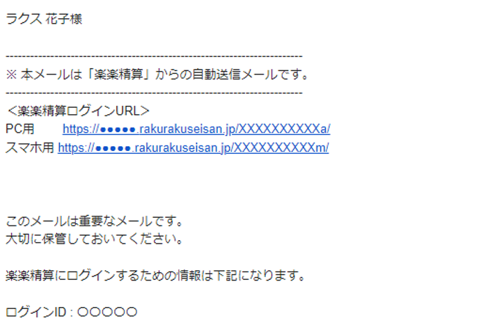

## 1-1. パスワードを設定する

ログインするためには 、パスワードを設定する必要があります。
申請者がパスワードを設定するには、「楽楽精算」から送信される「パスワード設定メール」で設定します。

**設定手順**

1. 新規登録ユーザーに下記のパスワード設定メールが届きます。  
件名：【楽楽精算】ユーザ登録完了のお知らせとパスワード設定のご案内  
  
2. メール内の「パスワード設定用URL」をクリックし、任意のパスワードを入力して「確定」をクリックします。  

3. パスワードの設定が完了したら、新規登録ユーザーに下記のようなメールが届き、ログインURLや、ログインIDが通知されます。


```
**注意**
「パスワード有効期限」が過ぎるとパスワードを設定できなくなります。
パスワード有効期限が過ぎた場合は、パスワード設定メールの再送が必要となるため、社内の「楽楽精算」管理者に連絡してください。
```     
