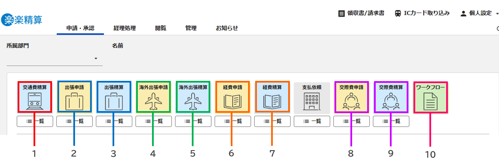

## 1-5. TOP画面（ログイン成功画面）

**1. 交通費や出張費の精算**  
外出や出張の際にかかった経費を入力します。  
**2. 経費や支払依頼の精算**  
立て替えて物品購入した際などに入力します。  
**3. 個人設定**    
ログアウトやパスワードの変更ができます。
スマートフォンの場合も、画面右上のユーザー名をタッチするとパスワードを変更できます。  
**4. 一時保存／差戻し**  
一時保存した伝票や、差し戻しされた伝票がある場合に表示されます。

