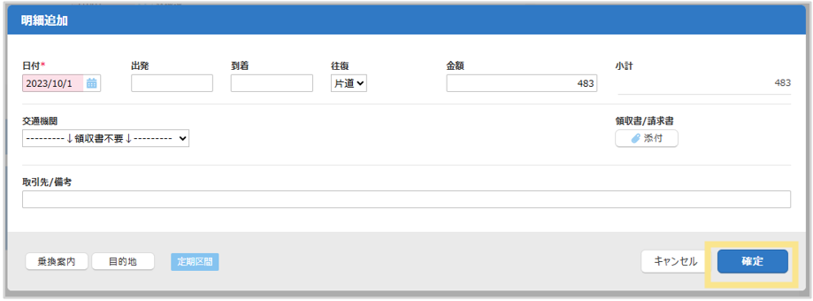
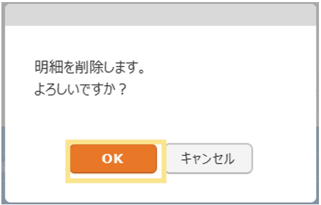

# 2. 申請・精算手順
## 2-2. 明細の修正・コピー・削除

### 明細の修正・コピー  
1. 追加済の明細を修正する場合は「鉛筆マーク」をクリック  
明細をコピーする場合は「紙マーク」をクリック  
  

2. 明細情報入力欄が表示されるので、内容を修正（変更）して、「確定」をクリック  
  

### 明細の削除  
1. 削除したい明細の「ゴミ箱マーク」をクリック    
  

2. 「OK」をクリック   
  

&nbsp;  
[トップに戻る](../index.md)