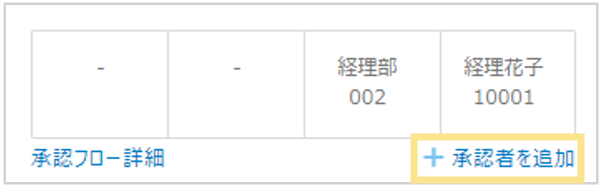
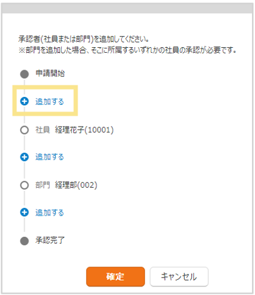
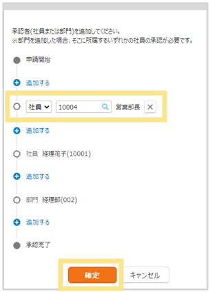

# 2. 申請・精算手順
## 2-3. 承認者の追加

申請内容により承認者が変わる場合や、一時的に承認者を追加する場合に使用します。  
「承認者の追加」は追加のみ可能で、削除や承認フローの編集はできません。

**承認者の追加方法**
1. 伝票右上の「承認者の追加」をクリック  
  

2. 承認フローが表示されたら、追加したい箇所の＋をクリック  

3. 承認ポイントが追加されるので、「社員」または「部門」を選択  
※「部門」は指定した部門に所属し承認権限を持ついずれかの社員の承認となります。  

4. 「虫眼鏡」マークをクリックし、対象の承認ポイントを選択  
  
5. 2～4をくりかえし、承認ポイントを設定後、画面下の「確定」をクリック  

&nbsp;
[トップに戻る](../index.md)