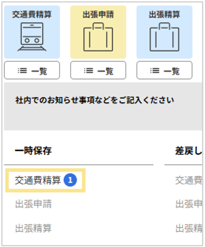
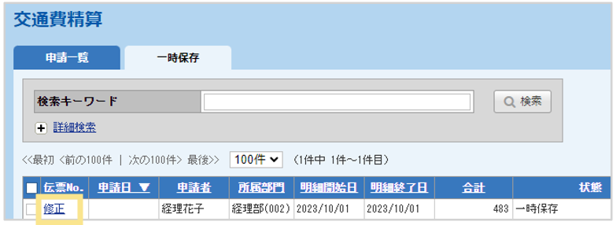
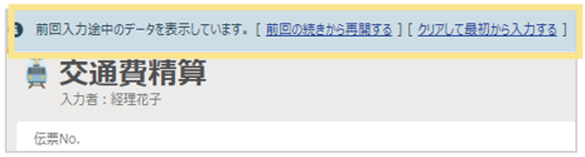

# 2. 申請・精算手順
## 2-4. 伝票の一時保存

### 作成途中の伝票の保存方法（一時保存）  
1. 伝票入力後、伝票画面下部にある「一時保存」をクリック  

2. 保存した伝票の呼び出す際は、「申請・承認」画面にある「一時保存」の各申請種別名をクリック  

3. 一覧画面が表示される  

4. 伝票No.の「修正」をクリックすると、伝票が表示される  

5. 呼び出した伝票の入力が完了したら「申請」をクリック  
各申請アイコン下部の「一覧」からも一時保存伝票の確認ができます。  

### 伝票の自動保存  
「明細の追加」「更新」「削除」を行った時に入力中のデータを自動保存（30日間）します。
  

※各種申請・精算、支払依頼の直前の1伝票分のみ自動保存されます。  
※自動保存データは、あくまで一時的な保存状態のため、ブラウザ設定やネットワーク状況により消えてしまう場合があります。保存しておきたい伝票データは必ず「一時保存」することをおすすめします。

&nbsp;  
[トップに戻る](../index.md)