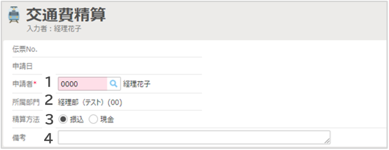

# 3. 各種申請・精算画面の説明
## 3-1. 交通費精算

- ヘッダ項目の説明（例）  
  

    ||||
    |---|---|---|
    |**1**|**申請者**|自動表示されます。代理申請をする場合は変更します。|
    |**2**|**所属部門**|自動表示されます。|
    |**3**|**精算方法**|振込が現金支給か、希望を選択します。|
    |**4**|**備考**|「○月分交通費」など概要を記入します。|

- 補助ボタンの説明  
  

    ||||
    |---|---|---|
    |**1**|**クレジットカード**|使用しません|
    |**2**|**ICカード**|ICカード履歴を取り込めます。|
    |**3**|**領収書/請求書**|領収書を添付します。|
    |**4**|**CSV**|CSVファイルから明細を取り込めます。|
    |**5**|**マイパターン**|よく使用する経路を登録できます。|

- 明細項目の説明（例）  
  

    ||||
    |---|---|---|
    |**1**|**日付**|費用の発生日を入力します。|
    |**2**|**訪問先**|訪問先を入力します。|
    |**3**|**出発（駅）**|出発地を入力します。|
    |**4**|**到着（駅）**|到着地を入力します。|
    |**5**|**金額**|金額を入力します。|
    |**6**|**往復**|「往復」にすると金額が倍になります。|
    |**7**|**小計**|自動で表示されます。|
    |**8**|**税率**|変更する場合はチェックを付け、税率を選択します。|
    |**9**|**負担部門**|負担部門を選択します。初期値は所属部門が表示されます。|
    |**10**|**交通機関**|プルダウンから交通機関を選択します。|
    |**11**|**備考**|備考情報を入力します。|
    |**12**|**領収書/請求書**|領収書などを添付します。|
    |**13**|**証票**|領収書などがある場合にチェックをつけます。|
    |**14**|**乗換案内**|乗換案内を利用します。|
    |**15**|**目的地**|過去の入力履歴や、予め登録された目的地を呼び出せます。|

&nbsp;  
[トップに戻る](../index.md)

