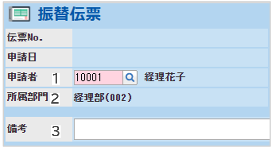

# 3. 各種申請・精算画面の説明
## 3-11. 振替伝票

- ヘッダ項目の説明（例）  
  

  ||||
    |---|---|---|
    |**1**|**申請者**|申請者は自動表示されます。代理申請をする場合は変更してください。|
    |**2**|**所属部門**|所属部門は自動表示されます。|
    |**3**|**備考**|備考情報を記入します。|

- 明細項目の説明（例）  
  

    ||||
    |---|---|---|
    |**1**|**日付**|計上日を入力します。|
    |**2**|**借方：勘定科目**|借方勘定科目を入力します。|
    |**3**|**借方：補助科目**|借方補助科目を入力します。|
    |**4**|**借方：税区分**|借方税区分を入力します。|
    |**5**|**借方：内訳**|借方が費用科目の場合、内訳を入力します。|
    |**6**|**借方：金額**|金額を入力します。※貸借同額になります。|
    |**7**|**借方：税額**|借方の税額が表示されます。|

貸方についても、同様の項目を入力します。
入力が完了したら、右下の「明細追加」をクリックします。

「明細追加」後、内容を確認し「申請」をクリックし、申請します。

&nbsp;
[トップに戻る](../index.md)