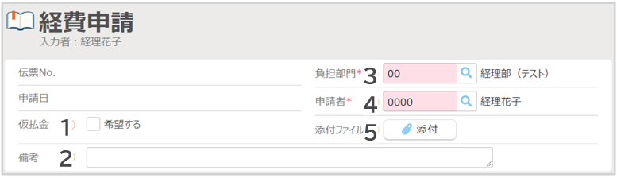
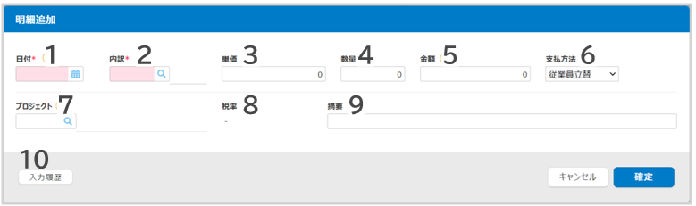

# 3. 各種申請・精算画面の説明
## 3-6. 経費申請

- ヘッダ項目の説明（例）  
  

  ||||
    |---|---|---|
    |**1**|**仮払金**|仮払金を希望する場合はチェックをつけます。|
    |**2**|**備考**|備考情報を記入します。|
    |**3**|**負担部門**|負担部門を選択します。初期値は所属部門が表示されます。|
    |**4**|**申請者**|自動表示されます。代理申請をする場合は変更してください。|
    |**5**|**添付ファイル**|稟議書など関連資料がある場合は添付します。|

- 明細項目の説明（例）  
  

    ||||
    |---|---|---|
    |**1**|**日付**|費用の発生予定日を入力します。|
    |**2**|**内訳**|費用内訳を選択します。|
    |**3**|**単価**|単価を入力します。|
    |**4**|**数量**|購入数量を入力します。|
    |**5**|**金額**|金額を入力します。 ※単価・数量を入力した場合は自動計算されます。|
    |**6**|**支払方法**|社員立替でない場合は変更してください。（法人カード利用時など）|
    |**7**|**プロジェクト**|プロジェクトを選択します。|
    |**8**|**税率**|選択した内訳に応じた税率が表示されます。|
    |**9**|**摘要**|詳細を記入します。|
    |**10**|**入力履歴**|過去の入力履歴を参照できます。|

&nbsp;
[トップに戻る](../index.md)