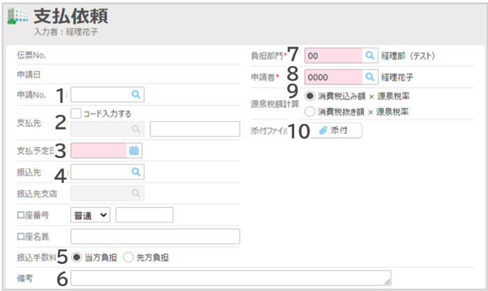

# 3. 各種申請・精算画面の説明
## 3-8. 支払依頼

- ヘッダ項目の説明（例）  
  

    ||||
    |---|---|---|
    |**1**|**申請No.**|事前申請がある場合は選択してください。|
    |**2**|**支払先**|取引先名を入力します。コード入力すると一覧から選択できます。|
    |**3**|**支払予定日**|取引先への支払予定日を入力します。|
    |**4**|**振込先情報**|振込口座情報を入力します。 ※コード入力の場合は自動で表示されます。|
    |**5**|**振込手数料**|どちらかを選択します。|
    |**6**|**備考**|備考情報を入力します。|
    |**7**|**負担部門**|負担部門を選択します。初期値は所属部門が表示されます。|
    |**8**|**申請者**|自動表示されます。代理申請をする場合は変更ください。
    |**9**|**源泉税額計算**|どちらかを選択します。|
    |**10**|**添付ファイル**|稟議書など関連資料がある場合は添付します。|

- 補助ボタンの説明  
**領収書/請求書**　　領収書を添付します。

- 明細項目の説明（例）  
  

    ||||
    |---|---|---|
    |**1**|**日付**|費用の発生日を入力します。|
    |**2**|**内訳**|費用内訳を選択します。|
    |**3**|**単価**|単価を入力します。|
    |**4**|**数量**|購入数量を入力します。|
    |**5**|**金額**|金額を入力します。 ※単価・数量を入力した場合は自動計算されます。|
    |**6**|**証票**|領収書などがある場合にチェックをつけます。|
    |**7**|**プロジェクト**|プロジェクトを選択します。|
    |**8**|**税率**|選択した内訳に応じた税率が表示されます。|
    |**9**|**摘要**|詳細を記入します。|
    |**10**|**領収書/請求書**|領収書などを添付します。|
    |**11**|**入力履歴**|過去の入力履歴を参照できます。|
    |**12**|**定額支払**|定期的に発生する支払依頼を一覧から選択できます。|

&nbsp;  
[トップに戻る](../index.md)