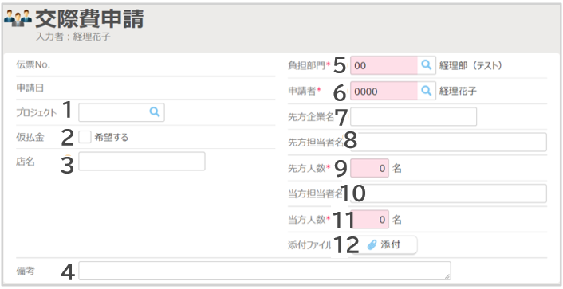

# 3. 各種申請・精算画面の説明
## 3-9. 交際費申請

- ヘッダ項目の説明（例）  
  

    ||||
    |---|---|---|
    |**1**|**プロジェクト**|プロジェクトを選択します。|
    |**2**|**仮払金**|仮払金を希望する場合はチェックをつけます。|
    |**3**|**店名**|利用した店名を入力します。|
    |**4**|**備考**|備考情報を記載します。|
    |**5**|**負担部門**|負担部門を選択します。初期値は所属部門が表示されます。|
    |**6**|**申請者**|自動表示されます。代理申請する場合は変更してください。|
    |**7**|**先方企業名**|先方の企業名を入力します。|
    |**8**|**先方担当者名**|先方の参加者を全員分入力します。|
    |**9**|**先方人数**|先方の参加人数を入力します。|
    |**10**|**当方担当者名**|当方の参加者を全員分入力します。|
    |**11**|**当方人数**||当方の参加人数を入力します。|
    |**12**|**添付ファイル**|稟議書など関連資料がある場合は添付します。|

- 明細項目の説明（例）  
  

    ||||
    |---|---|---|
    |**1**|**日付**|費用の発生予定日を入力します。|
    |**2**|**内訳**|費用内訳を選択します。|
    |**3**|**人数**|総人数を入力します。 ※ヘッダに入力した人数が自動で反映されます。|
    |**4**|**金額**|金額を入力します。|
    |**5**|**単価**|1名あたり単価を入力します。 ※人数・金額から自動計算されます。|
    |**6**|**摘要**|詳細を記入します。|
    |**7**|**支払方法**|社員立替でない場合は変更してください。（法人カード利用時など）|
    |**8**|**入力履歴**|過去の入力履歴を参照できます。|

&nbsp;
[トップに戻る](../index.md)