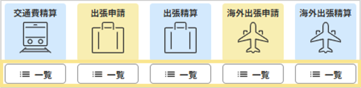
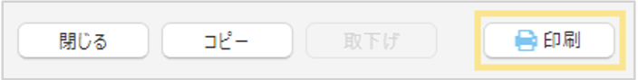
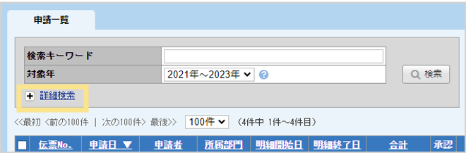

# 4. 提出内容の確認
## 4-1. 伝票の閲覧・印刷・検索方法

申請した伝票は各アイコンの「一覧」をクリックすることで確認できます。  
  

**伝票の閲覧方法**  
差戻しや取下げ（承認依頼をしていない状態）を含むすべての伝票を参照できます。伝票のコピーや取下げは、伝票No.をクリックして伝票画面を開いてから行います。  

**伝票の印刷方法**  
伝票を印刷する場合は、一覧から伝票No.をクリックして伝票画面を開いた後に、画面下部の「印刷」をクリックします。  
    
※一覧画面でチェックボックスにチェックを入れ、画面左下の「一括印刷」をクリックすることで、チェックを入れた伝票を一括で出力することができます。

**検索キーワードでの伝票検索**  
「詳細検索」をクリックすると申請日や申請者を指定して検索ができます。　  
    
     
&nbsp;
[トップに戻る](../index.md)