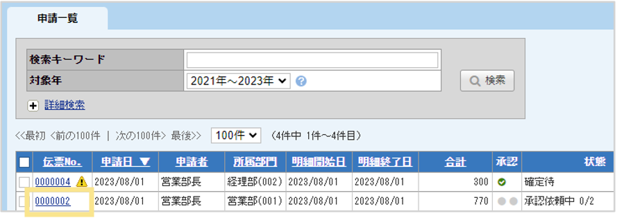
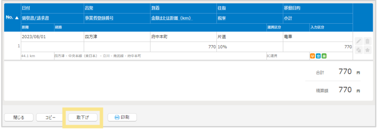

# 4. 提出内容の確認
## 4-2. 伝票の取下げ方法

申請済みの伝票を取り下げる場合の操作方法です。取り下げることができるのは、最終承認完了前の「承認依頼中」伝票のみです。  

### 伝票の取下げ方法  
1. 各アイコンの「一覧画面」から伝票No.をクリックして取り下げたい伝票を開きます。  
 

2. 伝票の下部に表示される「取下げ」をクリックします。  
    

3. 伝票状態が「取下げ」に変更されます。　
     
&nbsp;  
[トップに戻る](../index.md)