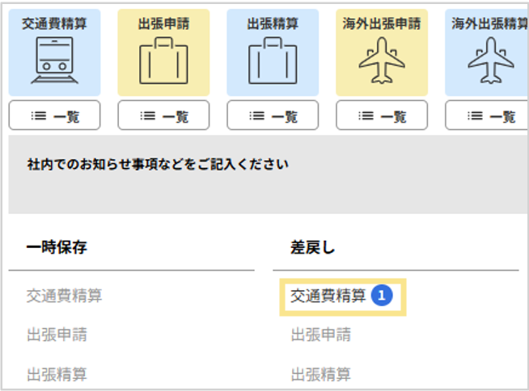
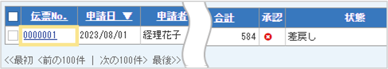
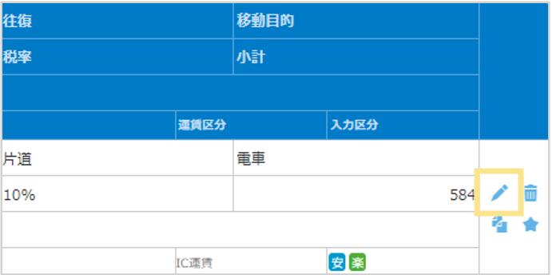

# 4. 提出内容の確認
## 4-3. 差し戻し伝票の対応

承認者によって差し戻された場合の対応方法を説明します。  

### 差し戻し伝票の修正・再申請方法  
1. 「申請・承認」画面に、差し戻しされた件数が表示されます。  
 

2. 修正を行いたい申請種別をクリック  

3. 伝票一覧が表示されます。差し戻された伝票の伝票No.をクリック  　
    

4. 伝票状態が「取下げ」に変更されます。　

5. 伝票のヘッダ、または明細の内容を修正します。明細を修正する場合は鉛筆マークをクリックして修正します。修正後は必ず「確定」をクリックします。
  

6. 修正が完了したら「申請」をクリック  

※重複申請などで差し戻しされ、伝票を削除する場合は、該当の伝票を開き「削除」ボタンをクリックしてください。
     
&nbsp;  
[トップに戻る](../index.md)