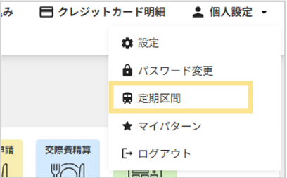
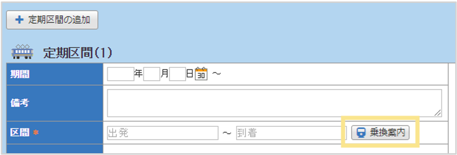
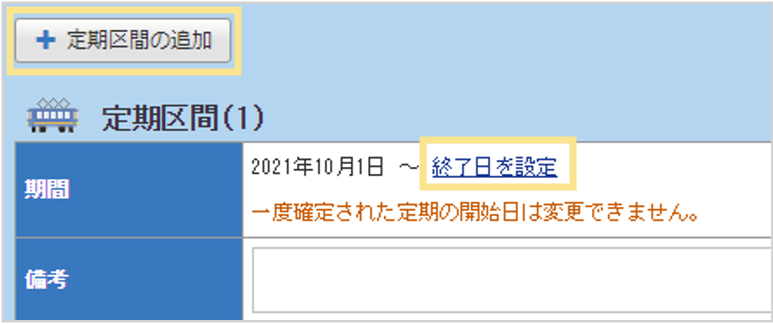

# 5. その他の機能
## 5-2. 定期区間の設定

自分の定期区間を申請する方法を説明します。  

### はじめて設定する場合  
1. 画面右上の「個人設定」から「定期区間」を選択  
 

2. 画面左下の「編集」をクリック  

3. 「区間」を入力し、「乗換案内」を起動して経路を選択
    

4. 「申請」をクリック

### 定期区間を変更する場合  
1. 画面右上の「個人設定」から「定期区間」を選択  

2. 画面左下の「編集」をクリック  

3. これまでの定期の「終了日」を設定し、「定期区間の追加」をクリック  
    

4. 新たな定期区間を追加登録し、「申請」をクリックします。  

&nbsp;  
[トップに戻る](../index.md)