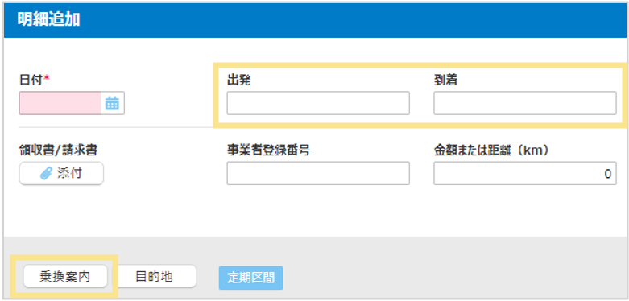
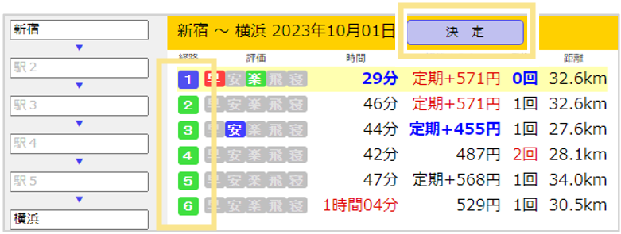
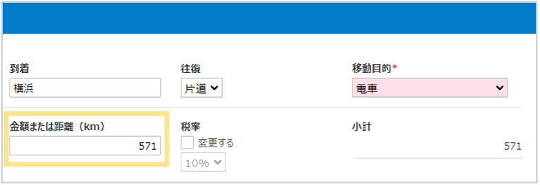
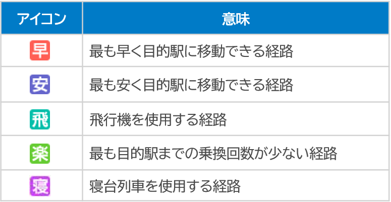

# 5. その他の機能
## 5-3. 乗換案内の利用方法

交通費・出張関連精算で乗換案内を利用する方法を説明します。  

1. 「出発」と「到着」を入力し、「乗換案内」をクリック  
 

2. 乗換案内の検索結果が表示されます。利用した経路を選択し、決定します。
  
※この画面で「出発」「到着」の経由駅を入力し「検索」することもできます。

3. 金額が明細に反映されます。  
  

4. 伝票状態が「取下げ」に変更されます。　

**乗換案内のアイコン**
  
     
&nbsp;
[トップに戻る](../index.md)