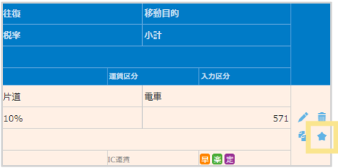
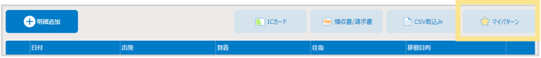
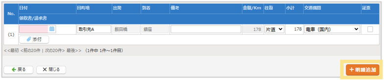
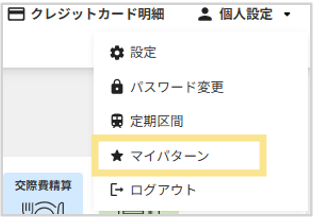

# 5. その他の機能
## 5-4. マイパターンの利用方法

### - マイパターンの登録  
1. 伝票作成画面で、登録した明細の「星マーク」をクリック  
   

2. 表示名を確認し、「登録」をクリック
  

### - マイパターン呼び出し  
1. 伝票作成画面で、「マイパターン」をクリック  
   

2. 利用するマイパターンにチェックを入れて「次へ」をクリック

3. 目的地、出発／到着、金額が取り込まれるので、その他情報を入力し、「明細追加」をクリック  
※画面上部の「一括反映」を利用すると、複数明細が一気に入力できます。
    

4. 伝票の明細行に、入力したデータが追加されます。

### - マイパターンの名称変更（削除）  
1. 画面右上の「個人設定」から「マイパターン」を選択    
   

2. 「名称変更」をクリック　
マイパターン名称が編集できます。  
※マイパターンを削除したい場合は、一覧画面で削除したい対象にチェックをつけ、画面下部の「削除」をクリックします。

&nbsp;  
[トップに戻る](../index.md)