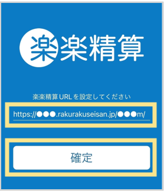
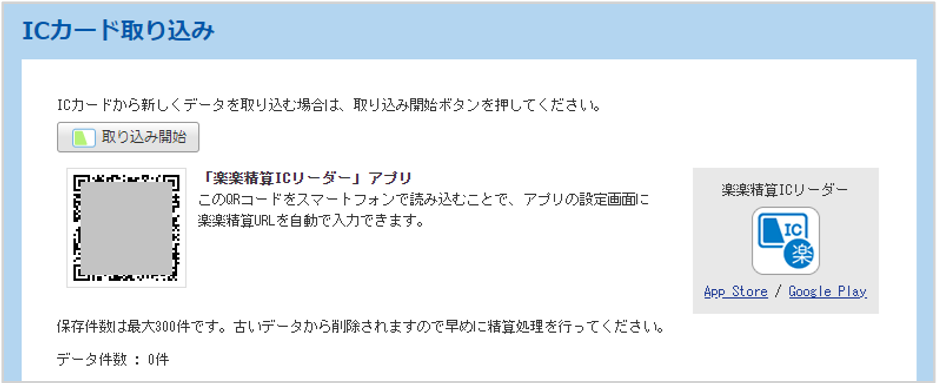
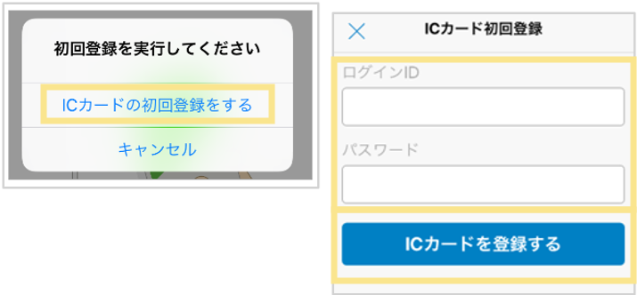
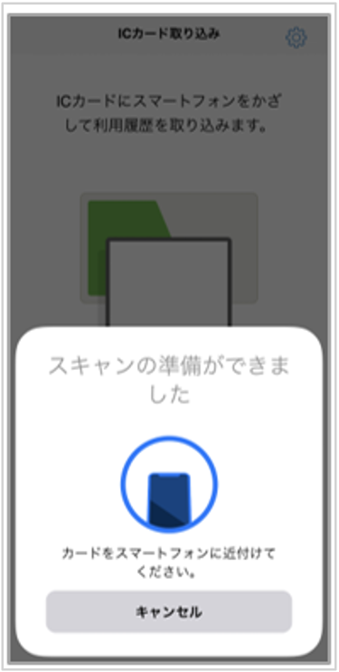
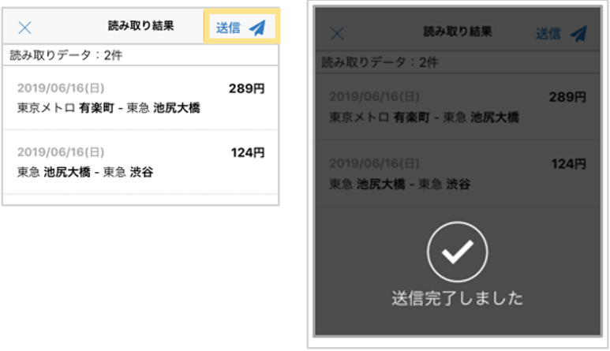
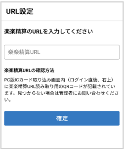
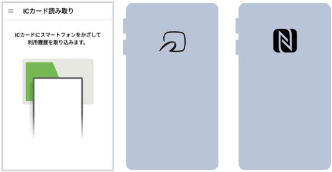
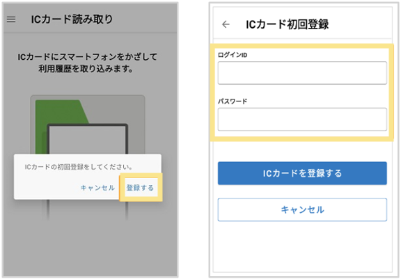
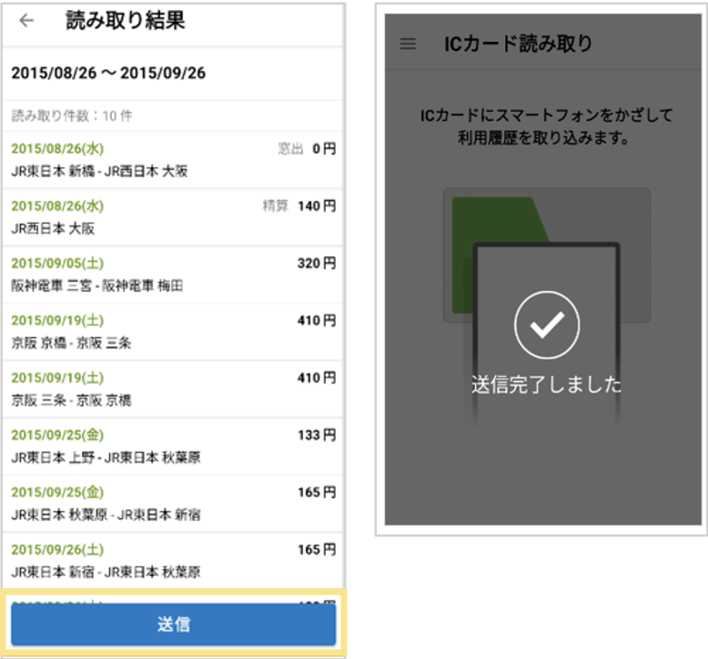

# 6. ICカードオプション
## 6-1. ICカード乗車履歴の取込方法 （iPhone）
※Androidは[こちら](#ICカード乗車履歴の取込方法-Android)  

**iPhone端末を使用する場合**
※App Storeより iPhone版「楽楽精算ICリーダー」アプリをインストールしてください。    
  

**アプリの初期設定**
アプリに「楽楽精算」URL（パソコン版URL、末尾a）を登録します。（[1-3. スマートフォンアプリでのログイン方法](./1.loginandtop/1-3.md)参照）

※スマートフォンブラウザ版URL（末尾m）は登録できません。  
※URLは、コピー＆ペーストでの入力や、QRコードでの読取も可能です。QRコードは、「楽楽精算」ログイン後右上の「ICカード取り込み」または、申請画面の「ICカード」ボタンをクリックすると、表示されます。  
  
  

1. 「楽楽精算ICリーダー」アプリを開く  
2. 初めて「楽楽精算」に取り込むICカードをかざした場合、「初回登録を実行してください」というメッセージが出ます。「ICカードの初回登録をする」をタップし、ICカードを登録  
  

3. 「ICカードにスマートフォンをかざして利用履歴を取り込みます。」画面が開くので、「スキャンを始める」をクリック

4. 「スキャンの準備ができました」画面が表示されるので、ICカードを端末の背面上部にかざす  
  

5. 読取結果が表示されたら「送信」をタップ  
※自動送信設定をしている場合は表示されません。
  

## 6-1. ICカード乗車履歴の取込方法 （Android）

**Android端末を使用する場合**
※Google Playより Android版「楽楽精算ICリーダー」アプリをインストールしてください。    
  

**アプリの初期設定**
アプリに「楽楽精算」URL（パソコン版URL、末尾a）を登録します。（[1-3. スマートフォンアプリでのログイン方法](./1.loginandtop/1-3.md)参照）

※スマートフォンブラウザ版URL（末尾m）は登録できません。  
※URLは、コピー＆ペーストでの入力や、QRコードでの読取も可能です。QRコードは、「楽楽精算」ログイン後右上の「ICカード取り込み」または、申請画面の「ICカード」ボタンをクリックすると、表示されます。  
  
  

1. アプリを起動し、「ICカード読み取り画面」が表示されたらICカードをAndroid端末の背面のNFCマークにかざす  
  

2. 初めて「楽楽精算」に取り込むICカードをかざした場合、「初回登録を実行してください」というメッセージが出ます。ICカードと紐づけたいID・パスワードを入力し、「ICカードを登録する」をタップ  
  

3. 読取結果が表示されたら「送信」をタップ  
※自動送信設定をしている場合は表示されません。
  
     
&nbsp;
[トップに戻る](../index.md)