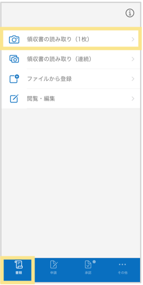
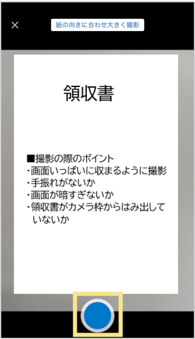
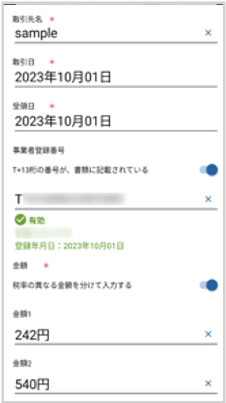
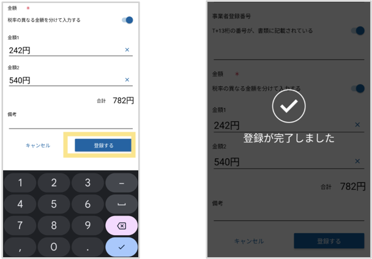
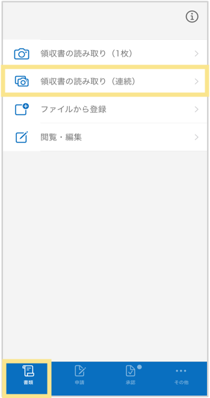
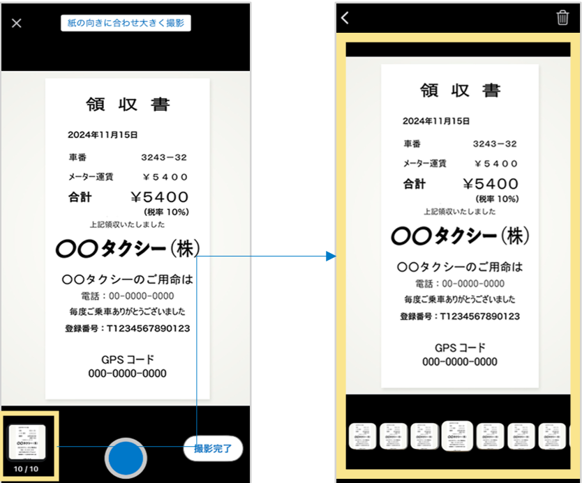
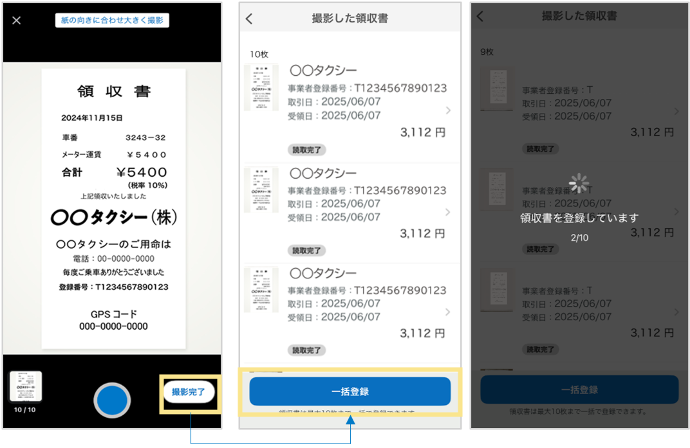
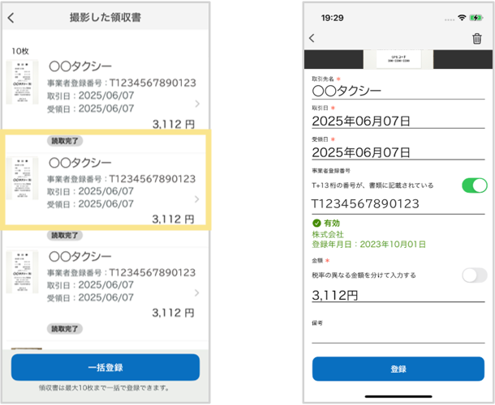
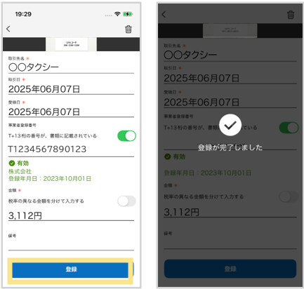

# 7. 電子帳簿保存法オプション
## 7-1. スマートフォンアプリからの取込

領収書／請求書の画像データを「楽楽精算」にアップロードする方法を説明します。  

### 【iPhone／Android】 スマートフォンアプリからのアップロード方法（1枚ずつ撮影する場合）  
※iPhoneの場合：iOSアプリ「楽楽精算」のダウンロードが必要です。  
※Androidの場合：Androidアプリ「楽楽精算」のダウンロードが必要です。  
※端末設定でアプリのカメラへのアクセスを許可してください。  

1. アプリにログインし、「書類」タブ > 「領収書の読み取り（1枚）」をタップ  
  

2. カメラで領収書を正面に捉え、シャッターボタンをタップして撮影する  
  

3. 読み取った結果が表示されるので内容を確認します。  
必要に応じて該当項目をタップして修正してください。  
  
- 「受領日」「取引日」を正しく読み取れなかった場合は、撮影した日付が自動で入力されます。
- 1枚の領収書の中で、伝票申請時に会計情報（勘定科目や税区分）が異なる場合は、登録時に複数明細に分けて登録することで、異なる会計情報で精算することができます。
- 税率が異なる場合（10%と軽減税率8%）は、金額が自動的に分かれて入力されます。
- 税率は同じでも勘定科目や負担部門が異なる、などで明細を分けて精算したい場合、読取時に自動で分けることはできませんので、手修正いただき金額を分けてください。
- 読取後の画面は上記の画面の通り、2行しか分けることができません。
その後、アプリの「閲覧・編集する」をタップし、該当の領収書の「編集」から複数明細に分けて登録をしてください。

4. 確認・修正が完了したら「登録する」をタップするとアップロード完了です。
  
アプリから写真を撮って登録した場合、保存形式は自動的に「スキャナ保存」として保存されます。    
※**「送信失敗入力内容に不備があります」** というエラーが表示された場合は、以下の点をご確認ください。  

**▼確認点**
- 「取引先」「受領日」「取引日」「金額」「事業者登録番号」の入力がすべて正しく入力されているか
- 「受領日」「取引日」の日付が正しく入力されているか
- 「取引先」の文字数が半角100文字以内に収まっているか
- 「備考」の文字数が半角400文字以内に収まっているか

### 【iPhone／Android】 スマートフォンアプリからのアップロード方法（複数枚をまとめて撮影する場合）  

1. アプリにログインし、「書類」タブ > 「領収書の読み取り（連続）」をタップ  
  

2. カメラで領収書を正面に捉え、シャッターボタンをタップして撮影する（最大10枚まで連続撮影することができます）  
  

3. 撮影画面左下の画像部分をタップすると、連続撮影した領収書がプレビュー表示されます。  
  

4. 画面右下の「撮影完了」をタップすると、「撮影した領収書」画面にて読み取り結果の一覧が表示されます。  
内容が問題ないか確認し、「一括登録」をタップするとアップロード完了です。  
※1件ずつ確認・修正する方法は、手順5.をご確認ください。  
  

5. 「撮影した領収書」画面にて領収書をタップすると、詳細画面が開き、読み取り結果を1枚ずつ確認可能です。必要に応じて該当項目をタップして修正してください。  
  
- 「受領日」「取引日」を正しく読み取れなかった場合は、撮影した日付が自動で入力されます。
- 1枚の領収書の中で、伝票申請時に会計情報（勘定科目や税区分）が異なる場合は、登録時に複数明細に分けて登録することで、異なる会計情報で精算することができます。
- 税率が異なる場合（10%と軽減税率8%）は、金額が自動的に分かれて入力されます。
- 税率は同じでも勘定科目や負担部門が異なる、などで明細を分けて精算したい場合、読取時に自動で分けることはできませんので、手修正いただき金額を分けてください。
- 読取後の画面は上記の画面の通り、2行しか分けることができません。その後、アプリの「閲覧・編集する」をタップし、該当の領収書の「編集」から複数明細に分けて登録をしてください。

6. 確認・修正が完了したら「登録」をタップすると、1枚ずつアップロードが完了します。  
  
アプリから写真を撮って登録した場合、保存形式は自動的に「スキャナ保存」として保存されます。  
※**「送信失敗入力内容に不備があります」** というエラーが表示された場合は、以下の点をご確認ください。

**▼確認点**
- 「取引先」「受領日」「取引日」「金額」「事業者登録番号」の入力がすべて正しく入力されているか
- 「受領日」「取引日」の日付が正しく入力されているか
- 「取引先」の文字数が半角100文字以内に収まっているか
- 「備考」の文字数が半角400文字以内に収まっているか
     
&nbsp;  
[トップに戻る](../index.md)