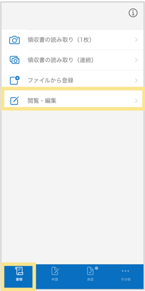
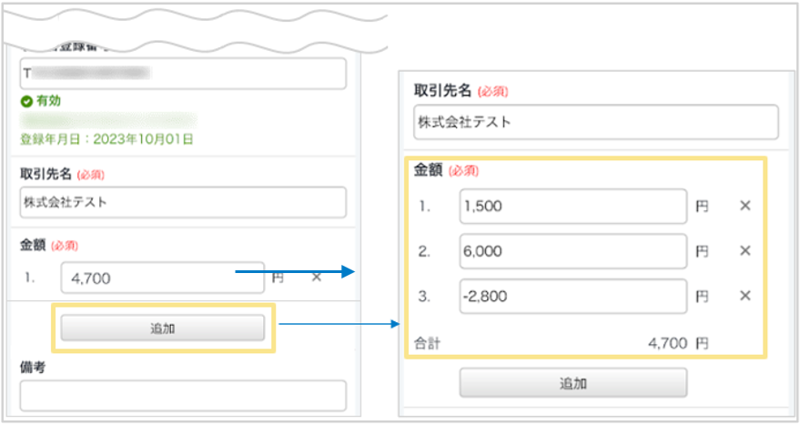

# 7. 電子帳簿保存法オプション
## 7-2. スマートフォンアプリ：複数明細に分けて登録する方法

スマートフォンアプリからの撮影時には、金額を**2行まで**分けて登録することができます。  
ここでは、勘定科目や税区分、負担部門などを分けて明細登録するにあたり、**3行以上に分けて登録したい場合**の手順をご案内します。
  
### 複数明細を登録する手順  
1. 領収書を撮影し、「登録する」をタップ  
2. 登録後、「書類」タブ >「閲覧・編集」をタップ    
  

3. 先ほどアップロードした領収書をタップし、「編集」をタップ    

4. 金額の「追加」をタップ、金額を分けて入力し、「確定」をタップ（最大99行まで分けることができます）　
  
  
&nbsp;  
[トップに戻る](../index.md)