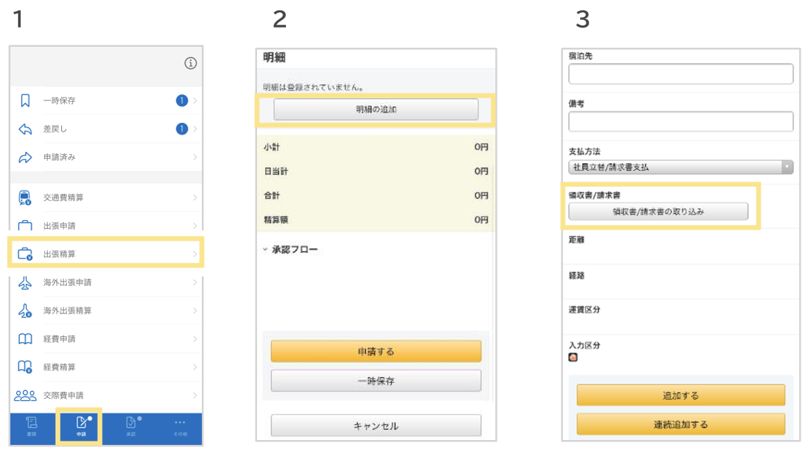
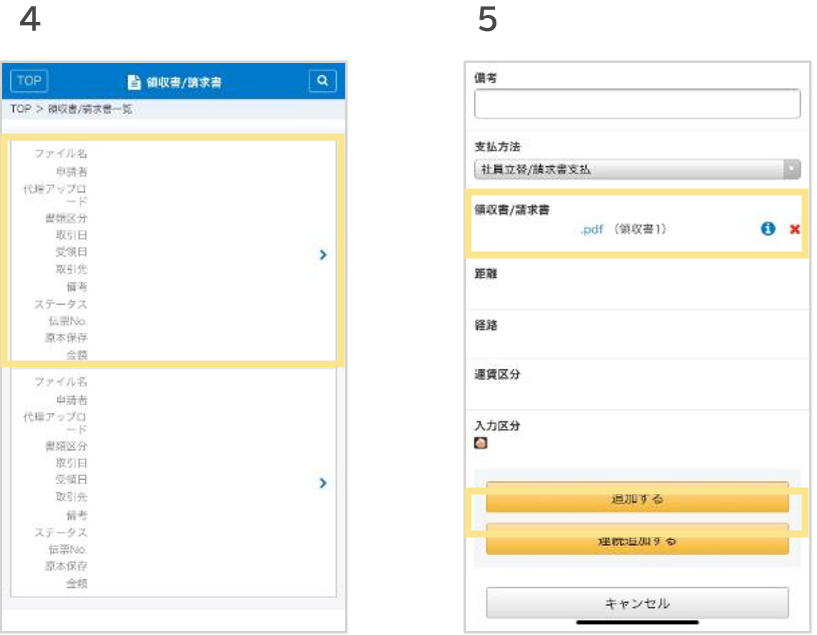

# 7. 電子帳簿保存法オプション
## 7-3.スマートフォンアプリ：伝票への紐づけ

### 取り込んだ領収書／請求書を、明細に紐づける方法  
1. 　「申請」タブ内、交通費精算・出張精算・経費精算などの領収書を反映したい申請種別をクリック
2. 「明細の追加」をクリック
3. 「領収書/請求書の取り込み」をクリック
4. 明細に紐づけたい「領収書/請求書」をクリック
5. 添付した領収書を確認し、「追加する」をクリック
    
  
  
  
&nbsp;  
[トップに戻る](../index.md)