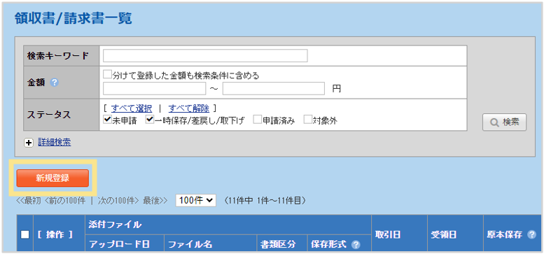
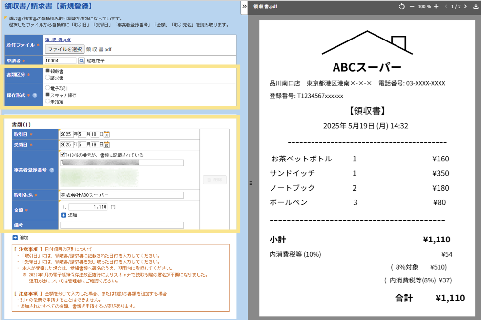

# 7. 電子帳簿保存法オプション
## 7-4. パソコンからのアップロード

スキャナで取り込んだ領収書／請求書や、電子データで受領したものについても、金額や取引先名を自動で反映することができます。

### 取り込んだ領収書／請求書を、明細に紐づける方法  
1. （事前に領収書・請求書を PDF でスキャン）  
2. TOP画面の右上、「領収書/請求書」をクリック  
  
3. 「新規登録」をクリック  
  
4. 添付ファイルを選択し、アップロード  
5. プレビュー表示される内容を確認しながら、反映された内容を確認。必要に応じて、入力項目を修正後、「確定」をクリック  
  
    
&nbsp;  
[トップに戻る](../index.md)