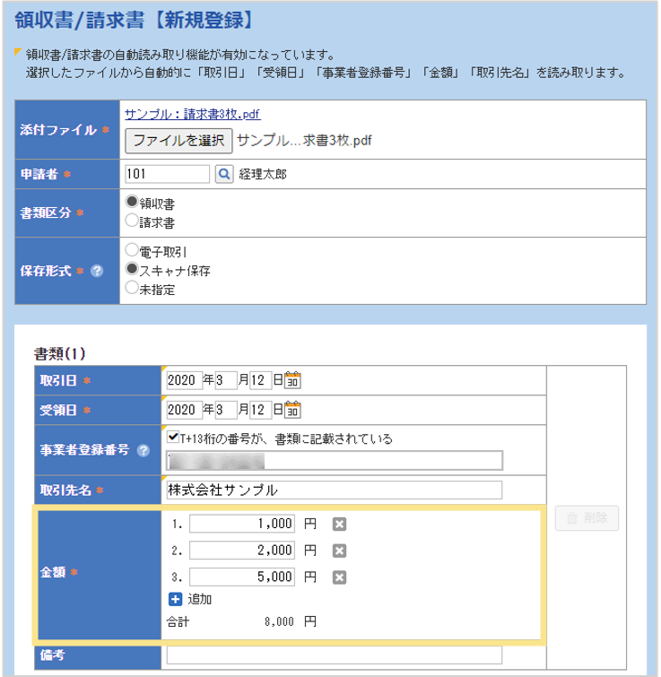

# 7. 電子帳簿保存法オプション
## 7-5. パソコン：複数明細に分けて登録する方法

1枚の領収書／請求書の中で税率が異なる場合や、選択したい内訳が異なる場合は、**領収書／請求書を登録する段階**で複数明細に分けて登録することで、異なる会計情報で精算することができます。

- 右の画面枠内の「追加」ボタンを押すことで、金額の追加が可能です。
- 税率は同じでも、勘定科目や負担部門が異なる、などで明細を分けて精算したい場合は金額を分けてください。
- 複数明細に分けて登録する場合でも、1枚の「領収書/請求書」は1枚の伝票でまとめて申請する必要があります。複数明細に分けて登録した1枚の「領収書/請求書」のうち、1明細だけを別伝票で申請することはできません。
- 外貨は複数明細に分けて登録することができません。
  
    
&nbsp;  
[トップに戻る](../index.md)