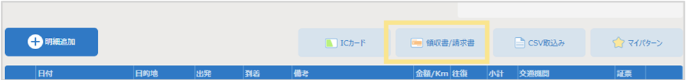
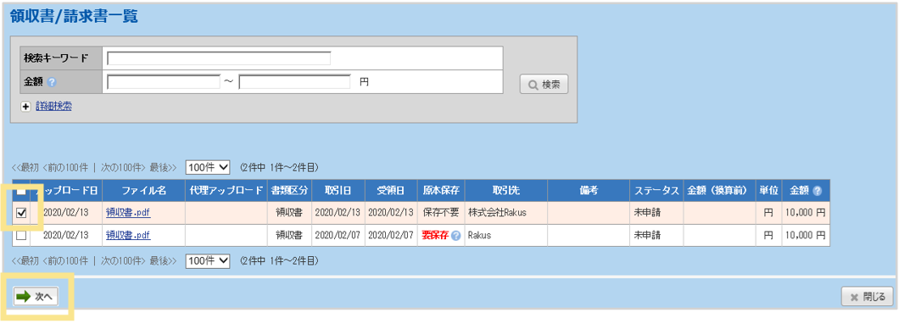
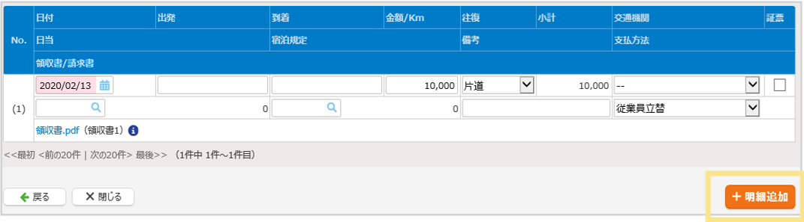

# 7. 電子帳簿保存法オプション
## 7-6. パソコン：伝票への紐づけ

取り込んだ領収書／請求書は、明細に反映することができます。    

### 手順  

領収書／請求書が紐づいている伝票の明細画面を開き、領収書／請求書の「×」をクリックして、紐づけを解除します。  

1. 交通費精算・出張精算・経費精算などの申請画面 明細欄右上の「領収書/請求書」をクリック
  

2. 明細に反映させたい領収書の左のチェックボックスにチェックを入れ、「次へ」をクリック  
  

3. 内容を確認し、必要があれば内容を修正して「明細追加」をクリック    
  

&nbsp;  
[トップに戻る](../index.md)