# 7. 電子帳簿保存法オプション
## 7-7. 領収書／請求書データの削除・修正【パソコンの場合】

アップロードした領収書／請求書の情報を、後から修正・削除する手順を【パソコン】【スマートフォン】それぞれ順にご案内します。  
削除・修正をする場合は、事前に**該当の領収書／請求書が伝票に添付されていない状態**にする必要があります。  
過去に伝票に添付している場合は、伝票からの紐づけを解除してから、削除・修正してください。  

### 【パソコンの場合】 伝票に紐づいている該当の領収書／請求書の紐づけを解除する  

領収書／請求書が紐づいている伝票の明細画面を開き、領収書／請求書の「×」をクリックして、紐づけを解除します。  
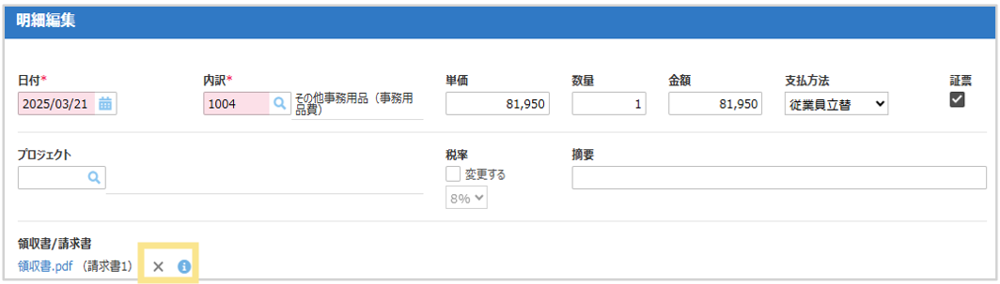  

**①「金額」や「書類」の数に変更がない場合の手順**  
1. 「領収書/請求書」の「添付」ボタンをクリック  
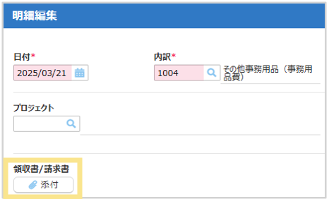  

2. 修正したい領収書／請求書の「編集」をクリック  
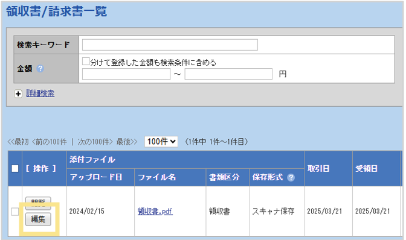  

3. 修正箇所を編集し、「確定」をクリック  
※「金額」や「書類」の追加を行う場合は手順①-2をご確認ください。  
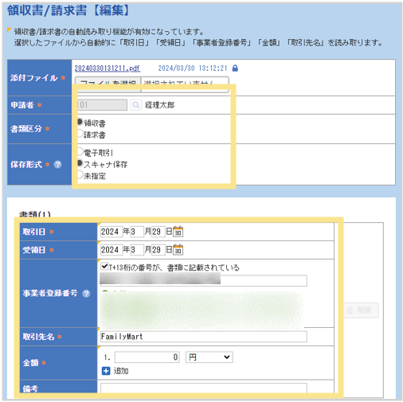  

4. 修正した領収書／請求書の「↓」ボタンをクリックし、明細に紐づける  
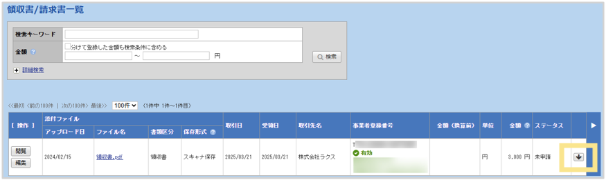  

**②「金額」や「書類」の数を追加する場合の手順**  
1. 「領収書/請求書」の「添付」ボタンをクリック  
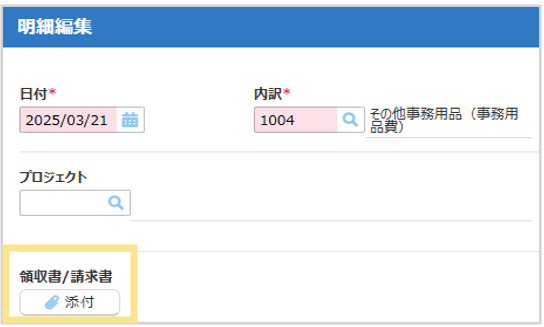  

2. 修正したい領収書／請求書の「編集」をクリック  
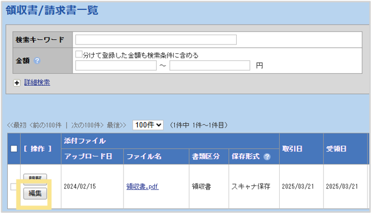  

3. 領収書／請求書の「金額」または「書類」を追加後、「確定」ボタンをクリック  
※その他の情報の修正も可能  
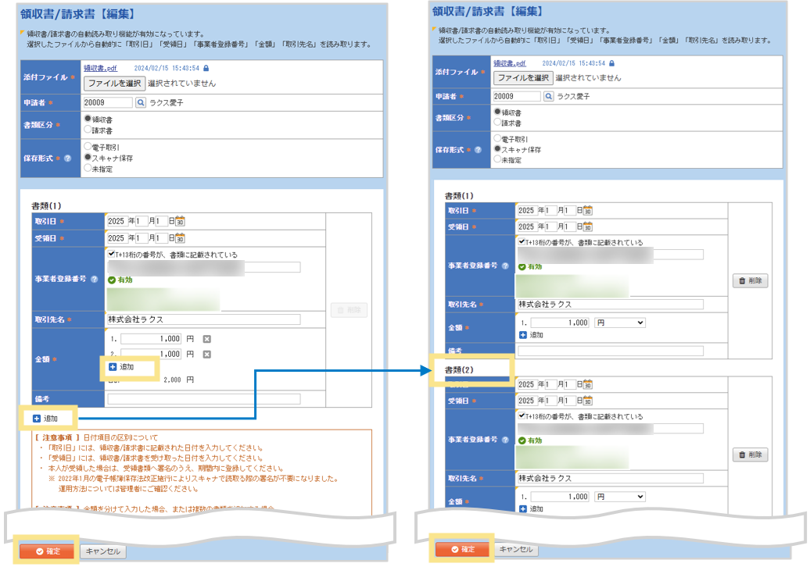  

4. 修正した領収書／請求書の一つ目の「↓」ボタンをクリックし、明細に紐づける  
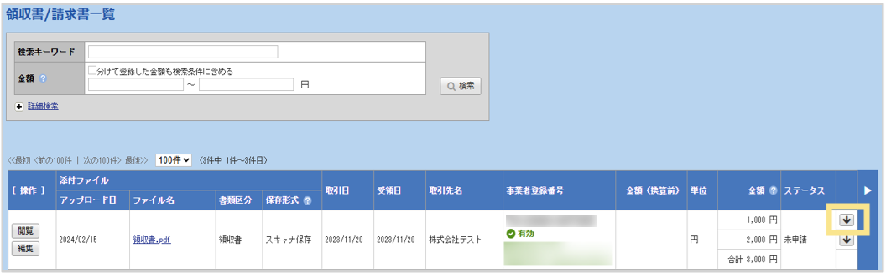  

5. 明細追加画面の「確定」ボタンをクリック  
6. 「明細追加」ボタンをクリック（明細コピーでも可能）  
7. 「領収書/請求書」の「添付」ボタンをクリック  

8. 追加した「領収書/請求書」の二つ目の「↓」ボタンをクリック    
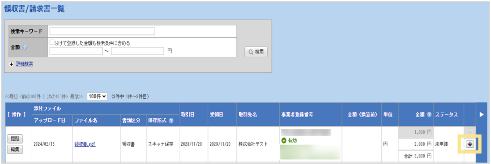  

9. 明細追加画面の「確定」ボタンをクリック  

**③「金額」や「書類」の削除をする場合の手順**  
1. 不要な伝票明細の削除ボタンをクリック  
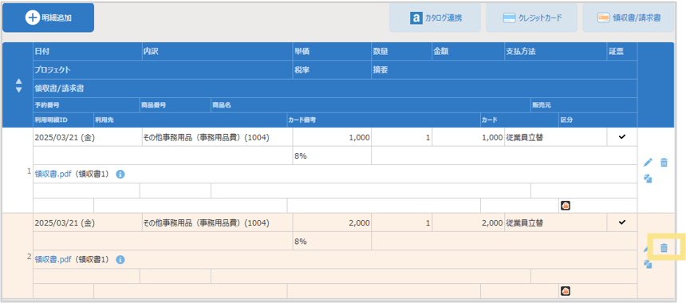  

2. 残った伝票明細の鉛筆マークをクリック  

3. 「領収書/請求書」の「添付」ボタンをクリック
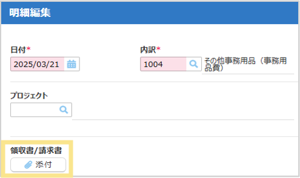  

4. 該当の領収書／請求書の「編集」ボタンをクリック  
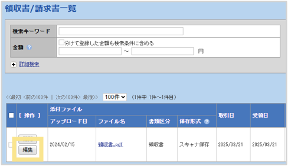  

5. 領収書／請求書の「金額」または「書類」を「×」ボタンで削除後、「確定」ボタンをクリック　※その他の情報の修正も可能
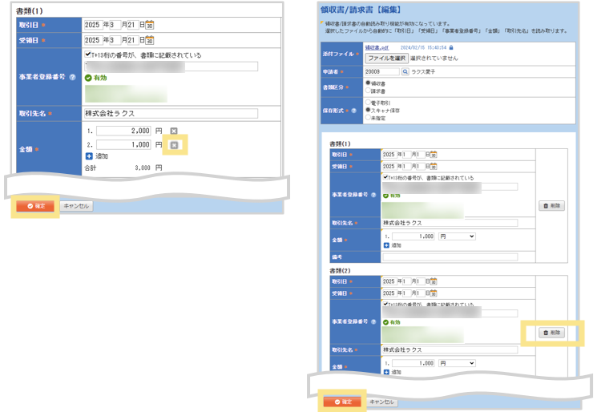  

6. 修正した「領収書/請求書」の「↓」ボタンをクリック
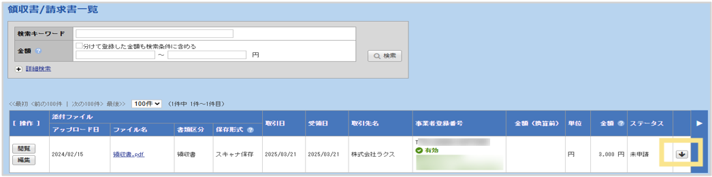  

7. 明細追加画面の「確定」ボタンをクリック

**注意事項**  
- 申請した領収書／請求書のPDFファイルが間違っているなどの理由で差し替えを行いたい場合は、対象の領収書／請求書が伝票に紐づいている状態では、差替・修正作業ができません。紐づいている伝票から対象の領収書／請求書を削除してから差し替え、修正作業を行ってください。
- スマートフォンからアップロードした領収書／請求書の編集は、申請者本人のみ行うことができます。

**④保存済みのPDFファイルを「削除」する場合**  
1. ログイン後の画面右上の 「領収書/請求書」をクリック  

2. 削除したいデータの左側にあるチェックボックスにチェックをつけ、「削除」をクリック  
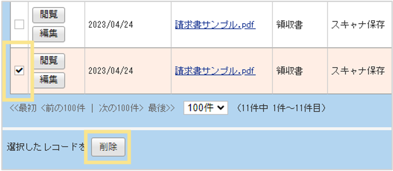 

3. コメント（必須）を入力し「確定」をクリック  
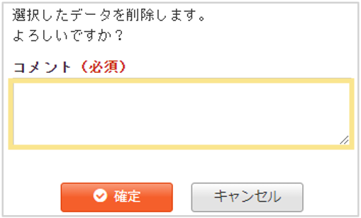  

## 7-7. 領収書／請求書データの削除・修正【スマートフォンの場合】

領収書／請求書が伝票に紐づいていないことが確認できましたら、以下手順で修正・削除することができます。

**①保存済みのPDFファイルを「削除・修正」する場合**  
1. 「書類」タブ > 「閲覧・編集」をタップ  
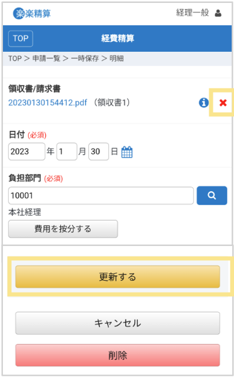 

2. 編集する該当の領収書／請求書をタップし、「編集」をタップ　※削除する場合は、「削除」をタップすると表示されるコメント（必須）を記載し、「OK」をタップします。  
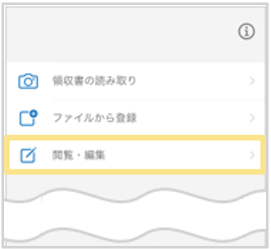 

3. ファイルを差し替える場合は、「アップロードする」から差し替えファイルを選択  
複数明細に分けて登録する場合は「追加」をタップし、金額を分けて入力します。日付や金額を修正する場合は「書類」欄より入力し、「確定」をタップします。  
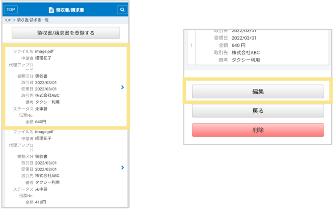 

&nbsp;  
[トップに戻る](../index.md)