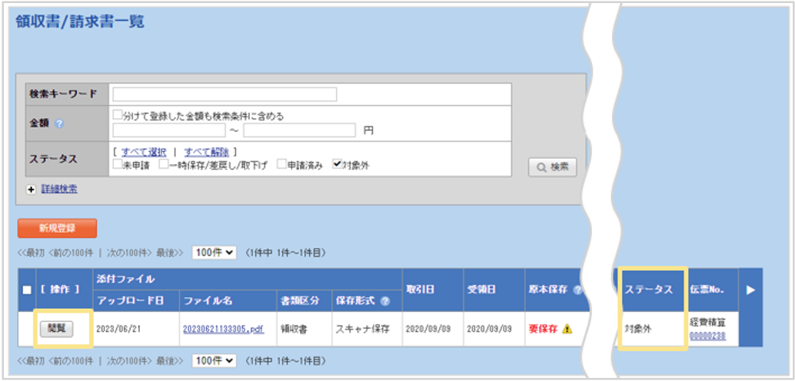
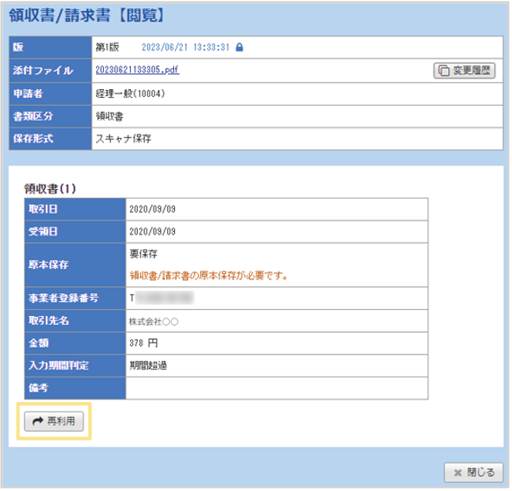

# 7. 電子帳簿保存法オプション
## 7-8. 否認処理された伝票に紐づく領収書／請求書データの再利用方法

否認処理された伝票に紐づく領収書／請求書データのステータスは「対象外」となります。  
以下の手順を行うことで、領収書／請求書データは再利用することができます。   

### 手順    

1. 「領収書／請求書」をクリック
  

2. ステータスが「対象外」のものを表示し、再利用したいデータの「閲覧」タブをクリック  
  

3. 左下にある「再利用」をクリック    
  
※領収書／請求書一覧上のステータスが「未申請」になっていれば再利用可能です。  

&nbsp;  
[トップに戻る](../index.md)