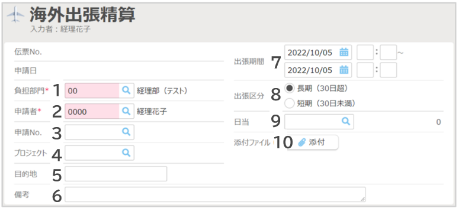

# 3. 各種申請・精算画面の説明
## 3-5. 海外出張精算

- ヘッダ項目の説明（例）  
  

    ||||
    |---|---|---|
    |**1**|**負担部門**|負担部門を選択します。初期値は所属部門が表示されます。|
    |**2**|**申請者**|自動表示されます。代理申請する場合は変更してください。|
    |**3**|**申請No.**|事前申請がある場合は選択してください。|
    |**4**|**プロジェクト**|プロジェクトを選択します。|
    |**5**|**目的地**|訪問先を記入します。|
    |**6**|**備考**|備考情報を記載します。|
    |**7**|**出張期間**|出張期間を入力します。日当計算のため時刻も入力してください。|
    |**8**|**出張区分**|どちらか選択します。|
    |**9**|**日当**|日当を選択します。|
    |**10**|**添付ファイル**|稟議書など関連資料がある場合は添付します。|

- 補助ボタンの説明  
  

    ||||
    |---|---|---|
    |**1**|**クレジットカード**|使用しません|
    |**2**|**ICカード**|ICカード履歴を取り込めます。|
    |**3**|**領収書/請求書**|領収書を添付します。|
    |**4**|**CSV**|CSVファイルから明細を取り込めます。|
    |**5**|**マイパターン**|よく使用する経路を登録できます。|

- 明細項目の説明（例）  
  

    ||||
    |---|---|---|
    |**1**|**日付**|費用の発生予定日を入力します。|
    |**2**|**出発**|出発地を入力します。|
    |**3**|**到着**|到着地を入力します。|
    |**4**|**単位**|通貨を選択します。|
    |**5**|**レート**|換算レートを入力します。|
    |**6**|**金額**|金額を入力します。|
    |**7**|**往復**|「往復」にすると金額が倍になります。|
    |**8**|**小計**|自動で表示されます。|
    |**9**|**交通機関**|プルダウンから交通機関（または費目）を選択します。|
    |**10**|**証票**|領収書などがある場合にチェックをつけます。|    
    |**11**|**宿泊手当**|宿泊手当を選択し、金額入力します。|
    |**12**|**備考**|備考情報を入力します。|
    |**13**|**支払方法**|社員立替でない場合は変更してください。（法人カード利用時など）|
    |**14**|**領収書/請求書**|領収書などを添付します。|
    |**15**|**乗換案内**|乗換案内を利用します。|
    |**16**|**目的地**|過去の入力履歴や、予め登録された目的地を呼び出せます.|

&nbsp;
[トップに戻る](../index.md)